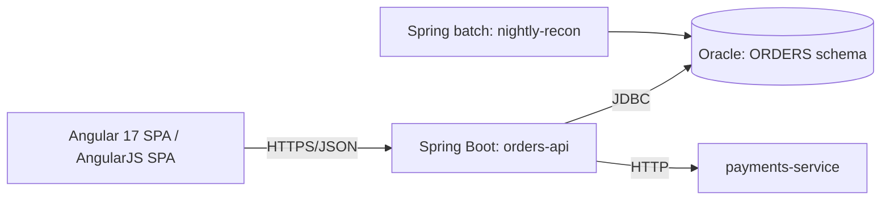
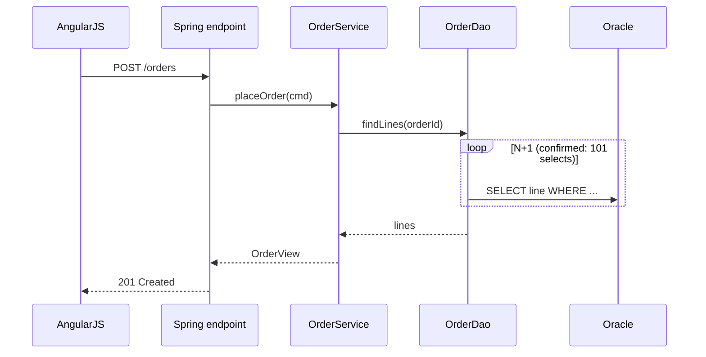

# Required Architectural Documentation

Produce documentation proportionate to the system, using lightweight C4-style
views and targeted runtime diagrams. Prefer Mermaid text so diagrams review in
version control. Generate from confirmed evidence where possible; **label inferred
elements explicitly**.

## The six views

1. **System context** — users, external systems, and the polyrepo application
   boundary.
2. **Container / deployable view** — AngularJS 1.x and Angular 17 (NX) apps,
   Spring Boot services/jobs, integration components, Oracle schemas.
3. **Component hot-spot view** — only for high-risk / high-change areas.
4. **Critical runtime sequences** — the most important user and batch workflows.
5. **Data ownership map** — authoritative sources, shared tables/schemas,
   cross-service database access.
6. **Deployment coupling map** — release ordering, compatibility windows, rollback
   dependencies.

## Mermaid patterns

Container view:

Critical runtime sequence:

Mark any element not backed by evidence with `%% inferred` or a note node, so a
reviewer can tell confirmed topology from hypothesis.
