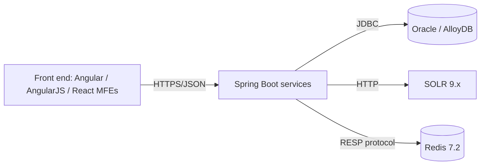

# Stabilization Spec-Driven Brief

<!--
PURPOSE — read this before filling anything in.

This file is the ONE deliverable designed to be fed, whole, into a Spec-Driven
AI development framework — for example BMad Method, GitHub Spec Kit (`/specify`),
Amazon Kiro, or a similar agent that turns a structured brief into PRDs, epics,
and stories. The REMEDIATION_MASTER_PLAN is for humans deciding what to do; THIS
file is machine-and-agent-facing input for generating the specs that implement it.

Rules that keep it useful as spec input:
- Self-contained. A spec agent will not have the workspace — inline the facts it
  needs (stack, constraints, backlog), and link evidence for humans only.
- Every claim carries its evidence state (Confirmed / Probable / Candidate / Not
  Reproducible) and confidence, so the downstream spec inherits the uncertainty
  instead of hardening a guess into a requirement.
- Never fabricate. Mark unknowns `unknown`. A spec built on invented facts is worse
  than a smaller honest one.
- The guardrails in section 4 are non-negotiable constraints the generated specs
  MUST carry forward: stabilize before modernize, preserve contracts, smallest
  reversible change, evidence before action.

HOW TO USE IT (state this to the user in plain words):
"This page is a ready-to-hand-off brief. Paste it into your spec-writing AI tool
(like BMad or Spec Kit) as the starting document. It already holds the project
story, the tech stack, the hard rules it must respect, and a ranked backlog of
work written as epics and stories — so the tool can draft the detailed specs
without re-discovering everything."
-->

## 0. Meta

- Generated from portfolio revision: ...
- Assessment date: ...
- Source artifacts: `REMEDIATION_MASTER_PLAN.md`, `evidence/findings.json`,
  `INITIAL_HEALTH_BASELINE.md`, `architecture/`
- Mode when generated: assessment-only | remediation-authorized
- Intended consumer: BMad Method / GitHub Spec Kit / Kiro / other spec-driven agent
- Confidence of this brief overall: High / Medium / Low (justify below)

## 1. Product & domain context

- What the system does, for whom (plain language): ...
- Business-critical user journeys (ranked): ...
- Current production symptoms driving this work: ...
- Out of scope / explicitly excluded: ...

## 2. Repository & deployable inventory

| Repo | Path/URL | Pinned SHA | Build | Deployables | Criticality | Owner |
|---|---|---|---|---|---|---|
| ... | ... | ... | ... | ... | ... | ... |

## 3. Technology stack (as discovered — mark `unknown` where unproven)

Record only what discovery supports; note any component that is *referenced but not
confirmed present*. The estate may include any of:

- **Front end:** AngularJS 1.x · Angular 17 (NX 17.3.x) · React 19
- **MFE composition:** Webpack 5 Module Federation (host + remotes)
- **Back end:** Java 21 · Spring Boot 2.7.18 and/or 3.5 · Hibernate · Maven 3.8+
- **Relational data:** Oracle 19c · AlloyDB (PostgreSQL-compatible, GCP)
- **Search:** SOLR 9.x
- **Cache:** Redis 7.2 (often GCP Memorystore)

| Layer | Technology & version | Repos | Confidence | Notes |
|---|---|---|---|---|
| Front end | ... | ... | ... | ... |
| MFE composition | ... | ... | ... | ... |
| Back end | ... | ... | ... | ... |
| Relational data | ... | ... | ... | ... |
| Search | ... | ... | ... | ... |
| Cache | ... | ... | ... | ... |

## 4. Non-negotiable constraints & guardrails (the generated specs MUST carry these)

- **Stabilize before modernize.** Specs default to the smallest reversible change
  that removes a *demonstrated* risk — not a rewrite or new framework.
- **Preserve contracts** — API, UI, database, event, batch, integration — unless a
  documented, authorized exception exists.
- **Evidence before action.** No spec asserts a DB defect (N+1, scan, missing
  index), a leak, or a bottleneck without a query count, execution plan, profile,
  or reproduction. Candidates stay candidates.
- **One cohesive change per story.** No mixing of unrelated fixes, upgrades,
  formatting, or renames.
- **Intervention ladder L0–L7.** Each story names its level and why lower levels are
  insufficient; L6–L7 need a decision record and explicit approval.
- **Not a security workstream.** Security review is out of scope here by design.

## 5. Architecture summary

Paste the confirmed context/container view and the traced critical path(s). Mark
inferred elements. Keep diagrams as Mermaid so the spec agent can reason over them.

- Critical runtime paths (link to `architecture/runtime-paths.md`): ...
- Known cross-repo / cross-service coupling: ...

## 6. Remediation backlog as epics & stories (the spec seed)

Derive each epic from a confirmed/planned finding or a coherent group. Keep the
finding ID as the stable trace key so generated specs map back to evidence. Order
by the master plan's ranking.

### EPIC [STAB-XX-0001] — <short name>
- **Source finding:** STAB-XX-0001 (status, confidence, evidence state)
- **Problem (plain language):** ...
- **Affected runtime path:** ...
- **Evidence:** what was measured/reproduced (or the evidence still to acquire)
- **Intervention level:** Lx — why lower levels are insufficient
- **Proposed stories:**
  - Story: characterize current behavior with a test asserting <measure>
  - Story: apply <minimum intervention> behind <flag/seam>
  - Story: verify <before/after measure> and add <one recurrence safeguard>
- **Acceptance criteria (pattern):** Given <state>, when <action>, then <observable
  result and the metric that proves it> — e.g. "query count for checkout drops from
  101 to ≤2 in the integration test."
- **Verification & rollback:** ...
- **Dependencies / ownership:** repos, teams, schema, release ordering

<!-- Repeat one EPIC block per finding or coherent group. -->

## 7. Non-functional requirements & budgets

State only budgets backed by a baseline or an explicit acquisition task; label
proxies. Examples: endpoint p95 latency, error rate, query count per critical path,
SOLR query p95, Redis hit ratio, JVM/GC, bundle size for the MFE host/remotes.

| NFR | Current (evidence) | Target | Applies to |
|---|---|---|---|
| ... | ... | ... | ... |

## 8. Glossary

Define every domain and technical term the spec agent will meet, in one line each,
so downstream specs use the words consistently.

## 9. Provenance & limitations

- Evidence links (for human reviewers): ...
- Unknowns and inaccessible sources: ...
- Claims that remain hypotheses (must not be hardened into firm requirements): ...
